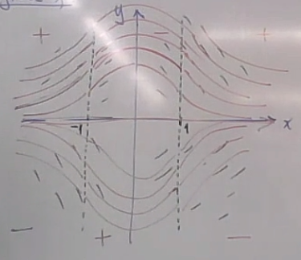
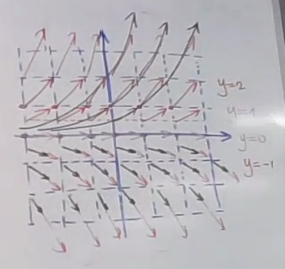

# Análisis de soluciones mediante campos de pendiente y concavidad

Siempre que tenemos un proceso que evoluciona de manera continua en el tiempo (u otra variable independiente) y no es aleatorio, la variable que describe el fenómeno es candidata a modelarse con una **ecuación diferencial ordinaria (EDO)**.

Una herramienta fundamental para entender su comportamiento sin necesidad de resolverla de forma explícita es el **campo de pendientes** o **diagrama de fase**.

## Teorema de existencia y unicidad

Consideremos una EDO de la forma:

$$
\frac{dy}{dx} = f(x,y)
$$

El teorema de existencia y unicidad garantiza que hay una única solución que pasa por cada condición inicial si se cumplen las siguientes condiciones:

1. $f(x,y)$ es continua en una región que contiene el punto inicial.
2. $\frac{\partial f}{\partial y}$ es continua en esa misma región.

Si estas condiciones no se cumplen, pueden ocurrir dos situaciones:

* No existe solución.
* Existen múltiples soluciones que pasan por el mismo punto inicial.

En ese caso, se requiere un análisis más detallado, punto por punto.

## Análisis de signos

Para estudiar una EDO cualitativamente se puede analizar el signo de la función y de su concavidad.

1. **Signo de $f(x,y)$ (pendiente de la solución):**

   * Si $f(x,y) > 0$: la solución **sube**.
   * Si $f(x,y) < 0$: la solución **baja**.
   * Si $f(x,y) = 0$: la solución es **horizontal** (punto de equilibrio o línea constante).

2. **Signo de $f\_x + f \cdot f\_y$ (concavidad):**

   * Si es positivo: la solución es **cóncava hacia arriba**.
   * Si es negativo: la solución es **cóncava hacia abajo**.
   * Si es cero: se tiene un **punto de inflexión**.

⚠️ Nota: Para determinar si en un punto con pendiente cero hay concavidad hacia arriba o abajo, se debe observar el comportamiento en sus alrededores.

### Ejemplo 1: $ \dfrac{dy}{dx} = xy $

Definimos:

$$
f(x,y) = xy
$$

* **Análisis de signo de $f(x,y)$:**

  * Cuadrante I ($x>0, y>0$): $f>0$
  * Cuadrante II ($x<0, y>0$): $f<0$
  * Cuadrante III ($x<0, y<0$): $f>0$
  * Cuadrante IV ($x>0, y<0$): $f<0$
  * Sobre los ejes $x=0$ o $y=0$: $f=0$ (pendiente horizontal).

* **Análisis de concavidad:**

  $$
  f_x + f f_y = y + (xy)(x) = y + x^2y = y(x^2+1)
  $$

  Como $x^2+1 > 0$ siempre, el signo depende de $y$:

  * Si $y>0$: concavidad hacia arriba.
  * Si $y<0$: concavidad hacia abajo.

Interpretación (como en la **imagen que compartiste**):

* En los cuadrantes I y II las curvas suben con concavidad hacia arriba.
* En los cuadrantes III y IV las curvas suben con concavidad hacia abajo.
* La recta $y=0$ es solución constante.

Esto genera curvas en forma de “U” arriba del eje $x$ y curvas invertidas debajo del eje $x$.

### Ejemplo 2: $ \dfrac{dy}{dx} = -xy $

Definimos:

$$
f(x,y) = -xy
$$

* **Análisis de signo de $f(x,y)$:**

  * Cuadrante I ($x>0, y>0$): $f<0$
  * Cuadrante II ($x<0, y>0$): $f>0$
  * Cuadrante III ($x<0, y<0$): $f<0$
  * Cuadrante IV ($x>0, y<0$): $f>0$
  * Sobre los ejes: $f=0$ (pendiente horizontal).

* **Concavidad:**

  $$
  f_x + f f_y = -y + (-xy)(-x) = -y + x^2y = y(x^2 - 1)
  $$

  Factorizamos:

  $$
  f_x + f f_y = y(x+1)(x-1)
  $$

  Estudio de signos:

  | Intervalo de $x$ | Signo de $(x+1)(x-1)$ | Resultado en $y>0$   | Resultado en $y<0$   |
  | ------------------ | ----------------------- | ---------------------- | ---------------------- |
  | $(-\infty,-1)$   | $+$                   | $+$ (cóncava arriba) | $-$ (cóncava abajo)  |
  | $(-1,1)$         | $-$                   | $-$ (cóncava abajo)  | $+$ (cóncava arriba) |
  | $(1,\infty)$     | $+$                   | $+$ (cóncava arriba) | $-$ (cóncava abajo)  |

Interpretación (también coherente con tu imagen):

* Existen **puntos de inflexión** en $x=-1$ y $x=1$.
* En la parte superior (cuando $y>0$), las curvas alternan entre concavidad hacia arriba y hacia abajo según los intervalos de $x$.
* En la parte inferior (cuando $y<0$), ocurre lo opuesto.
* La recta $y=0$ sigue siendo una solución constante.

### Notas adicionales

* Un **campo de pendientes** puede graficarse con flechas cortas (vector field) o con curvas suaves que siguen la dirección de las soluciones (streamplot).
* En Python, con **Matplotlib**, se utilizan funciones como `quiver` o `streamplot` sobre una malla generada con `meshgrid`.
* El **teorema de existencia y unicidad** garantiza que las soluciones no se cruzan: cada condición inicial genera una única curva.

## Campos vectoriales y su relación con las EDO

Un **campo vectorial** es una función:

$$
F : \mathbb{R}^n \to \mathbb{R}^m
$$

A cada punto del espacio (en un **grid** o malla de coordenadas) se le asigna un **vector**, el cual indica una dirección y magnitud.

* En $\mathbb{R}^2$, un campo vectorial se representa en un plano mediante flechas.
* En $\mathbb{R}^3$, se vería como una malla en el espacio de donde emergen los vectores.

En esencia, un campo vectorial describe **cómo se mueve algo** o la dirección en que evolucionan las trayectorias de un sistema.

### Relación entre EDO y campo vectorial

Dada una EDO de la forma:

$$
\frac{dy}{dx} = f(x,y)
$$

podemos asociarle un campo vectorial en $\mathbb{R}^2$:

$$
F(x,y) = \begin{pmatrix} 1 \\ f(x,y) \end{pmatrix}
$$

* La primera componente $(1)$ corresponde al **avance unitario en $x$**.
* La segunda componente corresponde a la **pendiente** de la solución en $(x,y)$.

Este es el **campo vectorial puro**. Sin embargo, en la práctica las flechas pueden aparecer demasiado grandes o pequeñas.

### Normalización del campo vectorial

Para evitar que los vectores den la impresión de que se cruzan o se deformen visualmente, se puede normalizar:

$$
\|F(x,y)\| = \sqrt{1 + \big(f(x,y)\big)^2}
$$

$$
\hat{F}(x,y) = \begin{pmatrix} \dfrac{1}{\sqrt{1+f(x,y)^2}} \\[8pt] \dfrac{f(x,y)}{\sqrt{1+f(x,y)^2}} \end{pmatrix}
$$

De esta forma, $\hat{F}$ es un **vector unitario** en la misma dirección que $F$.

### Equivalencia entre EDO y campo vectorial

Supongamos un campo vectorial en $\mathbb{R}^2$:

$$
F(x,y) = \begin{pmatrix} f_1(x,y) \\ f_2(x,y) \end{pmatrix}
$$

Entonces, la pendiente de las trayectorias es:

$$
\frac{dy}{dx} = \frac{f_2(x,y)}{f_1(x,y)}
$$

Es decir, el campo vectorial y la EDO son **dos representaciones equivalentes**:

* El campo vectorial es la **versión geométrica (visual)**.
* La EDO es la **versión analítica (ecuación)**.

### Ejemplo 1: $ \tfrac{dy}{dx} = y $

En este caso:

$$
F(x,y) = \begin{pmatrix} 1 \\ y \end{pmatrix}
$$

Construyamos un grid de puntos:

* Si $y=0$: los vectores son $(1,0)$, es decir, horizontales.
* Si $y=1$: los vectores son $(1,1)$, con pendiente $1$.
* Si $y=2$: los vectores son $(1,2)$, con pendiente $2$.
* Y así sucesivamente.

Esto genera un campo de flechas que se parece a las soluciones de la EDO:

$$
y(x) = Ce^x
$$

### Ejemplo 2: $ F(x,y) = (1,1) $

En este caso, el campo es constante:

$$
F(x,y) = \begin{pmatrix} 1 \\ 1 \end{pmatrix}
$$

Entonces:

$$
\frac{dy}{dx} = \frac{1}{1} = 1
$$

La EDO asociada es:

$$
\frac{dy}{dx} = 1
$$

y sus soluciones son:

$$
y(x) = x + C
$$

Es decir, las soluciones son rectas de pendiente $1$, paralelas entre sí, lo cual coincide con el campo vectorial (todas las flechas apuntan en la misma dirección).

✅ En resumen:

* Un **campo vectorial** es la representación visual de una EDO.
* Una **EDO** puede reconstruirse a partir de un campo vectorial.
* Ambos enfoques son equivalentes y complementarios: el campo es la “foto geométrica” de la ecuación diferencial.
