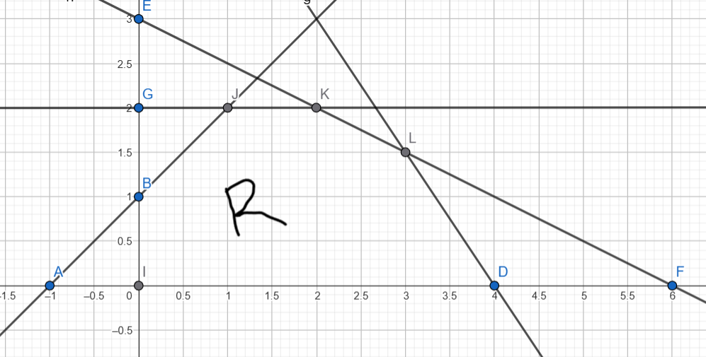
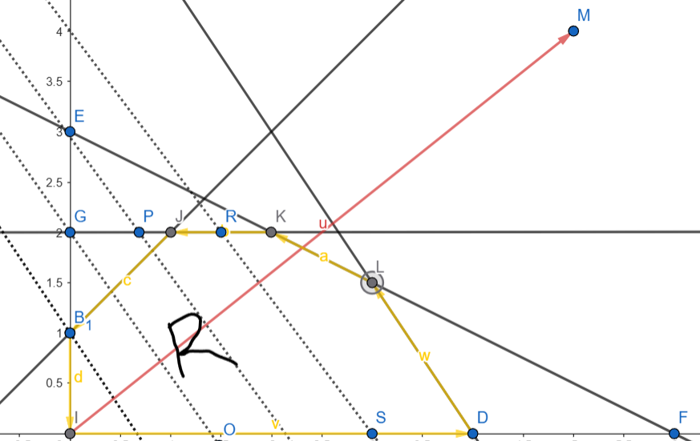

# Programación Lineal

Es un problema de optimización donde:

* La función objetivo es lineal.
* Las restricciones son lineales.

Ejemplo: una función de interés en un $\mathbb{R}^n$, esta función lineal se quiere maximizar/minimizar, donde se tiene una función tal que:

$$
f = c_1x_1 + c_2x_2 + \dots + c_nx_n
$$

Esto es una función $f$ sujeta a restricciones tal que se verán como:

$$
\begin{align*}
a_{11}x_1 + a_{12}x_2 + \dots + a_{1n}x_n &\leq (\geq)\ b_1 \\
a_{21}x_1 + a_{22}x_2 + \dots + a_{2n}x_n &\leq (\geq)\ b_2 \\
\vdots \\
a_{m1}x_1 + a_{m2}x_2 + \dots + a_{mn}x_n &\leq (\geq)\ b_m
\end{align*}
$$

Esto bajo la condición de que:

$$
x_1, x_2, \dots, x_n \geq 0
$$

Donde se tiene un "profit" y se desea minimizar la ganancia o los costos, dependiendo de variables de cantidades como producción de algún bien (horas, tiempo, dinero, unidades producidas). Estas variables deben ser no negativas para que tengan sentido, es decir, se impone una **restricción de no negatividad**.

Se puede tener una variable $x_j \in \mathbb{R}$ que puede tomar valores positivos o negativos, etc., donde $x_j$ **es no restringida** (no cumple la no negatividad). Esto puede existir pero no es muy común.

## Ejemplo 1

Maximizar:

$$
f(x) = 5x_1 + 4x_2
$$

Sujeto a:

$$
\begin{align*}
6x_1 + 4x_2 &\leq 24 \\
x_1 + 2x_2 &\leq 6 \\
-x_1 + x_2 &\leq 1 \\
x_2 &\leq 2 \\
x_1, x_2 &\geq 0 \quad \text{(regla de no negatividad)}
\end{align*}
$$

Este es un problema común de programación lineal. Supongamos que tenemos más información para este problema:

(Diagrama referencial de plano cartesiano)

$$
\text{(Aquí va un bosquejo de plano x1 vs x2 con restricciones)}
$$

Si tomamos la primera ecuación de restricción pero sin desigualdad:

$$
6x_1 + 4x_2 = 24
$$

Si $x_2 = 0$, entonces $x_1 = 4$, y si $x_1 = 0$, entonces $x_2 = 6$. Al colocar esos dos puntos se puede graficar la recta, y es la primera restricción. Ahora debemos analizar la desigualdad, que indica si la región válida está por debajo o por encima de la recta. Para saber esto, probamos un punto como $(0,0)$:

$$
6(0) + 4(0) = 0 \leq 24
$$

Esto lo cumple, lo que indica que la desigualdad corresponde a toda la región debajo de la recta.

Ahora analizamos la siguiente desigualdad:

$$
x_1 + 2x_2 = 6
$$

Al graficarla:

Si $x_2 = 0$, entonces $x_1 = 6$
Si $x_1 = 0$, entonces $x_2 = 3$

Probamos nuevamente con el punto $(0,0)$:

$$
0 + 0 = 0 \leq 6
$$

Esto cumple.

Y con:

$$
-x_1 + x_2 \leq 1
$$

Aquí tenemos que uno es $-1$ y otro es $1$, y con $x_2 \leq 2$ también se delimita otra región.

Graficamos también la ecuación de no negatividad. La región que resulta de esto es la **región factible** $\mathcal{R}$:

Es como un máximo local, y no puede serlo porque puede que la función vaya subiendo y resulte estar fuera. Hay que parar la búsqueda sobre la región factible porque no interesa buscar fuera de ella.

Hay una función con condiciones, y estas condiciones se reflejan en negocios como cantidad de productos A, B, C, etc. Se tiene que ver cómo vender el máximo de unidades con una máquina que produce cierta cantidad al día, etc. Estas restricciones suelen aparecer en las funciones de restricción. Sirve este tipo de problema para maximizar algo bajo ciertas condiciones, porque la solución **solo va a venir de la región factible**.

El máximo o mínimo sale (o tendría que salir) de ahí, y eso es lo que vamos a aprender: cómo obtener el máximo o mínimo sabiendo que está en la región factible.

## Interpretación Geométrica

En una región, las funciones se ven como un **hiperplano (plano)** definido como:

$$
f(x) = Z
$$

Esto define la altura del plano.

Ya que en la gráfica $x_2$ vs $x_1$ vamos a ver el plano como **rectas** (curvas de nivel), y vamos a obtener los máximos del **gradiente** de:

$$
f(x) = \left( \frac{\partial f}{\partial x_1}, \frac{\partial f}{\partial x_2} \right)
$$

La derivada parcial de la primera variable es $5$ y de la segunda es $4$, entonces:

$$
z = 5x_1 + 4x_2 \quad \Rightarrow \quad \nabla f = (5, 4)
$$

Este sería el vector que apunta en dirección positiva (hacia la derecha) y representa el **gradiente**. Las curvas de nivel son **ortogonales** a ese gradiente.

El gradiente nos indicará: si nos movemos hacia abajo, nos vamos al mínimo; si hacia arriba, $f$ crece. Entonces nos dirá cómo movernos para **maximizar** la función, moviéndonos en la dirección del gradiente **sin salirnos de la región factible**.

Queremos movernos en la región factible siguiendo las curvas de nivel **en dirección del gradiente**. Esto lo más grande posible, pero sin salir de la región factible. La **última esquina de la región factible** será el punto $L$.

Ese punto es donde está el **máximo** de la función, estando **dentro de la región factible**.

Si se quiere buscar el **mínimo**, sería lo mismo pero se ubica en la **esquina $I$**.

Podemos hacer el dibujo, pero en realidad no interesa esto, porque usando álgebra lineal tipo **Gauss-Jordan**, se pueden evaluar las esquinas de la región factible con un **algoritmo** para tomarlas. El algoritmo está diseñado para garantizar que el resultado **esté dentro de la región factible**.

## Convertir un Problema de PL a Forma Estándar

Se debe escribir en la **forma estándar**:

1. Todas las restricciones deben estar en forma de **igualdades** con el lado derecho **no-negativo** (dado que originalmente las restricciones son desigualdades, debe haber un proceso para convertirlas en igualdades).
2. Todas las **variables deben ser no negativas**.

### Introducción de Variables de Holgura o Superávit

Ejemplo:

$$
6x_1 + 4x_2 \leq 24
$$

Para convertirla en una igualdad, se agrega una **variable de holgura**:

$$
6x_1 + 4x_2 + s_1 = 24
$$

Este $s_1$ es como un comodín: al evaluar un valor en $x_1$ y $x_2$ que no suma 24, $s_1$ completa lo necesario para que la ecuación se cumpla.

Otro caso:

$$
5x_1 + 2x_2 \geq 15
$$

Aquí se añade una **variable de superávit**:

$$
5x_1 + 2x_2 - s_2 = 15
$$

Donde $s_1 \geq 0$ guarda el **faltante** y $s_2 \geq 0$ guarda el **sobrante**.

**¿Cómo saber cuál usar?**

* $\leq$ → **Holgura**
* $\geq$ → **Superávit**

### Variables No Restringidas

Si hay una variable no restringida (por ejemplo $x_3$):

$$
3x_1 + x_3 = 10
$$

Esto se transforma en:

$$
x_3 = x_3^+ - x_3^-
$$

Es decir, $x_3$ se divide en partes **no negativas**, como:

$$
3x_1 + (x_3^+ - x_3^-) = 10 \quad \text{donde } x_3^+, x_3^- \geq 0
$$

Dependiendo del valor original de $x_3$, se ajustan sus partes positiva y negativa.

### Forma Estándar del Ejemplo

Tomando el ejemplo:

Maximizar:

$$
f(x) = z = 5x_1 + 4x_2
$$

Sujeto a:

$$
\begin{align*}
1.\quad & 6x_1 + 4x_2 \leq 24 \\
2.\quad & x_1 + 2x_2 \leq 6 \\
3.\quad & -x_1 + x_2 \leq 1 \\
4.\quad & x_2 \leq 2 \\
5.\quad & x_1, x_2 \geq 0
\end{align*}
$$

Como el lado derecho ya es positivo, no se modifica. Solo agregamos variables para estandarizar:

$$
\begin{align*}
1.\quad & 6x_1 + 4x_2 + s_1 = 24 \\
2.\quad & x_1 + 2x_2 + s_2 = 6 \\
3.\quad & -x_1 + x_2 + s_3 = 1 \\
4.\quad & x_2 + s_4 = 2 \\
5.\quad & x_1, x_2, s_1, s_2, s_3, s_4 \geq 0
\end{align*}
$$
