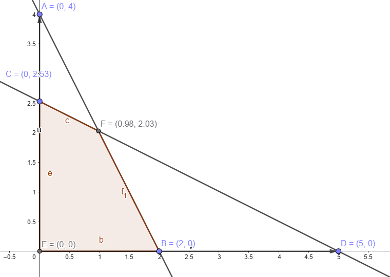

# Ejemplo 2: Programación Lineal

Maximizar:

$$
z = 2x_1 + 3x_2
$$

Sujeto a:

$$
\begin{align*}
2x_1 + x_2 &\leq 4 \\
x_1 + 2x_2 &\leq 5 \\
x_1, x_2 &\geq 0
\end{align*}
$$

## Forma Estándar

Aquí habría que añadir **variables de holgura** cuando las restricciones son $\leq$, y **variables de superávit** cuando son $\geq$. Tomamos las restricciones y la de no negatividad (que por ahora tomaremos aparte, ya que son parte estructural del problema).

Dado el ejemplo, añadimos variables de holgura y verificamos que el lado derecho sea positivo (lo cual ya lo es).

### Primera restricción

$$
2x_1 + x_2 + s_1 = 4
$$

### Segunda restricción

$$
x_1 + 2x_2 + s_2 = 5
$$

Entonces ya transformamos las restricciones originales añadiendo variables nuevas. Nuestra función objetivo **no cambia**:

$$
z = 2x_1 + 3x_2 + 0s_1 + 0s_2
$$

Esto es importante porque $s_1$ y $s_2$ pueden participar en la función, pero con coeficiente cero para no modificar la función original.

Con estas restricciones y condiciones:

$$
x_1, x_2, s_1, s_2 \geq 0
$$

...acabamos de convertir el problema a **forma estándar**. Esto lo hacemos para construir un sistema de ecuaciones lineales que nos permita aplicar técnicas para resolverlo.

## Representación matricial

Ahora escribimos el sistema como una matriz:

$$
\begin{align*}
2x_1 + x_2 + s_1 &= 4 \\
x_1 + 2x_2 + s_2 &= 5
\end{align*}
$$

La función objetivo la escribiremos como el **producto punto** de dos vectores:

$$
\textbf{C} = \begin{bmatrix} 2 \\ 3 \\ 0 \\ 0 \end{bmatrix}, \quad
\textbf{X} = \begin{bmatrix} x_1 \\ x_2 \\ s_1 \\ s_2 \end{bmatrix}
$$

Entonces:

$$
\max z = \textbf{C} \cdot \textbf{X}
$$

Y el sistema:

$$
\begin{bmatrix}
2 & 1 & 1 & 0 \\
1 & 2 & 0 & 1 \\
\end{bmatrix}
\cdot
\begin{bmatrix}
x_1 \\ x_2 \\ s_1 \\ s_2
\end{bmatrix}
=
\begin{bmatrix}
4 \\ 5
\end{bmatrix}
$$

Es decir:

$$
A \cdot X = B
$$

Y nuestra función objetivo es:

$$
\max z = C \cdot X = 2x_1 + 3x_2
$$

Sujeto a las restricciones anteriores y a:

$$
X \geq 0
$$

## Soluciones básicas

Cuando queremos resolver un problema de programación lineal, buscamos encontrar el máximo cumpliendo el sistema de ecuaciones, para saber qué combinación da el mayor valor de la función objetivo.

Proponemos una solución del sistema $A\cdot X = B$, que llamamos **solución básica** si **exactamente $n - m$ de sus entradas son 0**.

### ¿Quién es $m$?

Asumimos que $A \in \mathbb{R}^{m \times n}$:

* $m$ = número de restricciones (filas),
* $n$ = número de variables (columnas).

Una solución tiene $n$ variables, y cuando **$n - m$ variables son cero**, decimos que es una **solución básica**.

Fórmula para contar el número de soluciones básicas:

$$
\binom{n}{m} = \frac{n!}{m!(n-m)!}
$$

Para este ejemplo:

* $m = 2$
* $n = 4$

$$
\Rightarrow \binom{4}{2} = 6
$$

## Tabla de soluciones básicas

Recordando que:

* $m = 2$ (número de restricciones)
* $n = 4$ (número de variables: $x_1$, $x_2$, $s_1$, $s_2$)

Entonces, la cantidad de soluciones básicas es:

$$
\binom{4}{2} = 6
$$

Estas soluciones se construyen **eligiendo 2 variables básicas** (las otras 2 se igualan a 0), y resolviendo el sistema de ecuaciones.

Partimos de la tabla incompleta con combinaciones:

| n | $x_1$ | $x_2$ | $s_1$ | $s_2$ |
| - | -------- | -------- | -------- | -------- |
| 1 | 0        | 0        | ?        | ?        |
| 2 | 0        | ?        | 0        | ?        |
| 3 | 0        | ?        | ?        | 0        |
| 4 | ?        | 0        | ?        | 0        |
| 5 | ?        | 0        | 0        | ?        |
| 6 | ?        | ?        | 0        | 0        |

### Opción 1: $x_1 = 0$, $x_2 = 0$

Sustituyendo en las restricciones:

1. $2x_1 + x_2 + s_1 = 4 \Rightarrow s_1 = 4$
2. $x_1 + 2x_2 + s_2 = 5 \Rightarrow s_2 = 5$

| n | $x_1$ | $x_2$ | $s_1$ | $s_2$ |
| - | -------- | -------- | -------- | -------- |
| 1 | 0        | 0        | 4        | 5        |

### Opción 2: $x_1 = 0$, $s_1 = 0$

Sustituyendo en la primera restricción:

* $2(0) + x_2 + 0 = 4 \Rightarrow x_2 = 4$

Segunda restricción:

* $0 + 2(4) + s_2 = 5 \Rightarrow 8 + s_2 = 5 \Rightarrow s_2 = -3$

| n | $x_1$ | $x_2$ | $s_1$ | $s_2$ |
| - | -------- | -------- | -------- | -------- |
| 2 | 0        | 4        | 0        | -3       |

### Opción 3: $x_1 = 0$, $s_2 = 0$

Primera restricción:

* $2(0) + x_2 + s_1 = 4 \Rightarrow x_2 + s_1 = 4$ → (1)

Segunda restricción:

* $0 + 2x_2 + 0 = 5 \Rightarrow x_2 = 2.5$

Sustituimos en (1):

* $2.5 + s_1 = 4 \Rightarrow s_1 = 1.5$

| n | $x_1$ | $x_2$ | $s_1$ | $s_2$ |
| - | -------- | -------- | -------- | -------- |
| 3 | 0        | 2.5      | 1.5      | 0        |

### Opción 4: $x_2 = 0$, $s_2 = 0$

Primera restricción:

* $2x_1 + 0 + s_1 = 4 \Rightarrow 2x_1 + s_1 = 4$ → (2)

Segunda restricción:

* $x_1 + 0 + 0 = 5 \Rightarrow x_1 = 5$

Sustituimos en (2):

* $2(5) + s_1 = 4 \Rightarrow 10 + s_1 = 4 \Rightarrow s_1 = -6$

| n | $x_1$ | $x_2$ | $s_1$ | $s_2$ |
| - | -------- | -------- | -------- | -------- |
| 4 | 5        | 0        | -6       | 0        |

### Opción 5: $x_2 = 0$, $s_1 = 0$

Primera restricción:

* $2x_1 + 0 + 0 = 4 \Rightarrow x_1 = 2$

Segunda restricción:

* $2 + 0 + s_2 = 5 \Rightarrow s_2 = 3$

| n | $x_1$ | $x_2$ | $s_1$ | $s_2$ |
| - | -------- | -------- | -------- | -------- |
| 5 | 2        | 0        | 0        | 3        |

### Opción 6: $s_1 = 0$, $s_2 = 0$

Primera restricción:

* $2x_1 + x_2 + 0 = 4 \Rightarrow 2x_1 + x_2 = 4$ → (3)

Segunda restricción:

* $x_1 + 2x_2 + 0 = 5 \Rightarrow x_1 + 2x_2 = 5$ → (4)

Multiplicamos (3) por 2:

* $4x_1 + 2x_2 = 8$

Ahora restamos con (4):

* $4x_1 + 2x_2 - (x_1 + 2x_2) = 8 - 5 \Rightarrow 3x_1 = 3 \Rightarrow x_1 = 1$

Sustituimos en (3):

* $2(1) + x_2 = 4 \Rightarrow x_2 = 2$

| n | $x_1$ | $x_2$ | $s_1$ | $s_2$ |
| - | -------- | -------- | -------- | -------- |
| 6 | 1        | 2        | 0        | 0        |

## Tabla Final de Soluciones Básicas

| n | $x_1$ | $x_2$ | $s_1$ | $s_2$ | Factible |
| - | -------- | -------- | -------- | -------- | -------- |
| 1 | 0        | 0        | 4        | 5        | ✔️       |
| 2 | 0        | 4        | 0        | -3       | ❌        |
| 3 | 0        | 2.5      | 1.5      | 0        | ✔️       |
| 4 | 5        | 0        | -6       | 0        | ❌        |
| 5 | 2        | 0        | 0        | 3        | ✔️       |
| 6 | 1        | 2        | 0        | 0        | ✔️       |

> ⚠️ Algunas combinaciones generan valores **negativos** en las variables de holgura, por lo tanto, **no son factibles** (violación de $X \geq 0$).
>
> De forma geometrica si dibujamos las rectas de restricción y las de no negatividad (originales) esto nos dará un área factible dad por 6 intersecciones, que es el binomio que hicimos antes ademas la región factible esta dada por 4 esquinas y 2 de las intersecciones fuera, las cuales son los resultados para no factible

## Algoritmo Simplex

Partimos del siguiente problema en forma estándar:

## Datos

### Función objetivo

$$
\max z = \mathbf{C} \cdot \mathbf{X} = 2x_1 + 3x_2
$$

### Sistema de restricciones

$$
\begin{bmatrix}
2 & 1 & 1 & 0 \\
1 & 2 & 0 & 1 \\
\end{bmatrix}
\cdot
\begin{bmatrix}
x_1 \\ x_2 \\ s_1 \\ s_2
\end{bmatrix}
=
\begin{bmatrix}
4 \\ 5
\end{bmatrix}
$$

Esto se escribe como:

$$
A \cdot X = B
$$

Con:

* $\mathbf{X} = (x_1, x_2, s_1, s_2)^\top$
* $\mathbf{C} = (2, 3, 0, 0)^\top$
* Condición: $\mathbf{X} \geq 0$

## Paso 1: Tabla Inicial del Método Simplex

Convertimos la función objetivo a forma canónica:

$$
z - 2x_1 - 3x_2 = 0
$$

La tabla inicial se organiza así:

| Base  | coef  | $x_1$ | $x_2$ | $s_1$ | $s_2$ | Término independiente |
| ----- | ----- | ----- | ----- | ----- | ----- | --------------------- |
| $z$   |   1   | -2    | -3    | 0     | 0     | 0                     |
| $s_1$ |   0   | 2     | 1     | 1     | 0     | 4                     |
| $s_2$ |   0   | 1     | 2     | 0     | 1     | 5                     |

> La primera fila representa los coeficientes de la función objetivo y su igualación.
> Las siguientes filas contienen los coeficientes provenientes de la **matriz $A$** del sistema de restricciones.

## Paso 2: Interpretación Geométrica y Base Canónica

Esta tabla representa la **solución básica inicial** correspondiente al origen $(x_1 = 0, x_2 = 0)$, como vimos en la interpretación geométrica.

* Variables **no básicas**: $x_1$, $x_2$ (valen 0)
* Variables **básicas**: $s_1 = 4$, $s_2 = 5$ (valores no nulos)

Si observamos las columnas correspondientes a $s_1$ y $s_2$ en la matriz, se forma una **base canónica**:

$$
\begin{bmatrix}
1 & 0 \\
0 & 1
\end{bmatrix}
$$

Esto indica que $s_1$ y $s_2$ son **vectores unitarios** de $\mathbb{R}^2$, por lo tanto se consideran **variables básicas**.

> Lo que acabamos de hacer es llenar la tabla inicial del método simplex, que corresponde a **trabajar en el origen**. Este punto es una **solución básica inicial**.

## Paso 3: ¿Quién entra y quién sale?

### 3.1 Determinar variable que entra a la base

Revisamos la fila de $z$. Los coeficientes negativos indican que aún se puede mejorar la función objetivo.

Buscamos el mayor en valor absoluto:

$$
\text{Máximo negativo: } -3 \Rightarrow \text{entra } x_2
$$

> **NOTA**: Si hubiera empate entre dos columnas con el mismo valor negativo más grande (por ejemplo -3 en $x_2$ y -3 en otra variable), **puede elegirse cualquiera** como pivote.

### 3.2 Determinar variable que sale de la base

Tomamos la **columna pivote** ($x_2$) y realizamos cocientes:

* Fila $s_1$: $\frac{4}{1} = 4$
* Fila $s_2$: $\frac{5}{2} = 2.5$

Estos cocientes **deciden cuál variable sale** de la base:

> Se ignoran divisiones por cero o cocientes negativos.

El menor cociente positivo es:

$$
\min\{4, 2.5\} = 2.5 \Rightarrow \text{sale } s_2
$$

## Paso 4: Operaciones de Pivoteo

* **Columna pivote**: la de $x_2$
* **Fila pivote**: la de $s_2$
* **Elemento pivote**: 2 (en posición $s_2, x_2$)

> Lo que haremos ahora es **marcar la columna y fila pivote**, y realizar las operaciones iterativas del algoritmo simplex.

### 4.1 Normalizar la fila pivote

La nueva fila pivote se obtiene dividiendo entre el valor del pivote:

$$
\text{Nueva } F_{\text{piv}} = \frac{F_{\text{piv}}}{\text{pivote}}
$$

En este caso:

$$
\text{Fila } s_2 \Rightarrow \frac{[0, 1, 2, 0, 1 \mid 5]}{2}
\Rightarrow [0, 0.5, 1, 0, 0.5 \mid 2.5]
$$

La variable $x_2$ entra, $s_2$ sale.

### 4.2 Sustituir en el resto de las filas

Ahora ajustamos las demás filas para **convertir en 0 todos los valores en la columna pivote**, excepto el 1 que ya hicimos en la fila pivote (esto es como una **reducción gaussiana**).

$$
\text{Nueva fila } F_i = F_i - (\text{coef. pivote en fila i}) \cdot F_{\text{piv}}
$$

#### Actualizar fila de $z$

Coeficiente de $x_2$ en fila $z$ es $-3$, por lo tanto:

$$
F_z = F_z - (-3) \cdot F_{\text{piv}} = F_z + 3 \cdot F_{\text{piv}}
$$

$$
\begin{aligned}
\text{coef}: & 1 + 3(0) = 1 \\
x_1: & -2 + 3(0.5) = -0.5 \\
x_2: & -3 + 3(1) = 0 \\
s_1: & 0 + 3(0) = 0 \\
s_2: & 0 + 3(0.5) = 1.5 \\
f:   & 0 + 3(2.5) = 7.5
\end{aligned}
$$

#### Actualizar fila de $s_1$

Coeficiente de $x_2$ en fila $s_1$ es $1$, por lo tanto:

$$
F_{s_1} = F_{s_1} - 1 \cdot F_{\text{piv}}
$$

$$
\begin{aligned}
\text{coef}: & 0 - 1(0) = 0 \\
x_1: & 2 - 1(0.5) = 1.5 \\
x_2: & 1 - 1(1) = 0 \\
s_1: & 1 - 1(0) = 1 \\
s_2: & 0 - 1(0.5) = -0.5 \\
f:   & 4 - 1(2.5) = 1.5
\end{aligned}
$$

## Resultado de la primera iteración

| Base  | coef  | $x_1$ | $x_2$ | $s_1$ | $s_2$ | f   |
| ----- | ----- | ----- | ----- | ----- | ----- | --- |
| $z$   |   1   | -0.5  | 0     | 0     | 1.5   | 7.5 |
| $s_1$ |   0   | 1.5   | 0     | 1     | -0.5  | 1.5 |
| $x_2$ |   0   | 0.5   | 1     | 0     | 0.5   | 2.5 |

> Hemos movido el punto solución desde el origen $(0, 0)$ hacia otra esquina del polígono factible (en este caso, hacia la dirección de $x_2$).
> La función objetivo aumentó de $z = 0$ a $z = 7.5$

Perfecto. A continuación, edité y mejoré tu continuación del ejemplo manteniendo **exactamente el formato de tabla que pediste**, respetando tu estilo y complementando las operaciones con claridad y precisión. Las fracciones están convertidas a **punto decimal**, y todo el proceso está alineado con lo anterior.

## ¿Cuándo detenerse?

Para continuar con el algoritmo, **verificamos la fila de $z$**. Si **todavía hay coeficientes negativos**, entonces:

* Se puede seguir iterando.
* Se elige la variable asociada al valor negativo más grande (en valor absoluto).
* Se repite el proceso de pivoteo.

En nuestro caso, el coeficiente de $x_1$ es $-0.5$, por lo tanto **sí se puede seguir**.

## Segunda iteración del Simplex

### Paso 1: Determinar variable que entra y sale

El mayor coeficiente negativo en la fila de $z$ es $-0.5$, por lo tanto:

* **Entra**: $x_1$
* Ahora se calculan los cocientes para determinar quién **sale**:

$$
\begin{aligned}
\text{Fila } s_1: &\quad \frac{1.5}{1.5} = 1 \\
\text{Fila } x_2: &\quad \frac{2.5}{0.5} = 5
\end{aligned}
$$

Entonces:

* **Sale**: $s_1$
* **Pivote**: valor en intersección $s_1, x_1 = 1.5$

### Paso 2: Normalizar fila pivote

$$
F_{\text{piv}} = \frac{F_{s_1}}{1.5}
$$

$$
\begin{aligned}
x_1 &= \frac{1.5}{1.5} = 1.0 \\
x_2 &= \frac{0}{1.5} = 0.0 \\
s_1 &= \frac{1.0}{1.5} = 0.667 \\
s_2 &= \frac{-0.5}{1.5} = -0.333 \\
f &= \frac{1.5}{1.5} = 1.0
\end{aligned}
$$

| Base  | coef | $x_1$ | $x_2$ | $s_1$ | $s_2$  | f   |
| ----- | ---- | ----- | ----- | ----- | ------ | --- |
| $x_1$ | 2    | 1.0   | 0.0   | 0.667 | -0.333 | 1.0 |

### Paso 3: Actualizar las demás filas

#### Fila de $z$

Coeficiente de $x_1$ en fila $z$ es $-0.5$:

$$
F_z = F_z - (-0.5) \cdot F_{\text{piv}} = F_z + 0.5 \cdot F_{\text{piv}}
$$

$$
\begin{aligned}
x_1 &= -0.5 + 0.5(1.0) = 0.0 \\
x_2 &= 0 + 0.5(0.0) = 0.0 \\
s_1 &= 0 + 0.5(0.667) = 0.333 \\
s_2 &= 1.5 + 0.5(-0.333) = 1.333 \\
f &= 7.5 + 0.5(1.0) = 8.0
\end{aligned}
$$

#### Fila de $x_2$

Coeficiente de $x_1$ en fila $x_2$ es $0.5$:

$$
F_{x_2} = F_{x_2} - 0.5 \cdot F_{\text{piv}}
$$

$$
\begin{aligned}
x_1 &= 0.5 - 0.5(1.0) = 0.0 \\
x_2 &= 1.0 - 0.5(0.0) = 1.0 \\
s_1 &= 0.0 - 0.5(0.667) = -0.333 \\
s_2 &= 0.5 - 0.5(-0.333) = 0.667 \\
f &= 2.5 - 0.5(1.0) = 2.0
\end{aligned}
$$

## Resultado de la segunda iteración

| Base  | coef | $x_1$ | $x_2$ | $s_1$  | $s_2$  | f   |
| ----- | ---- | ----- | ----- | ------ | ------ | --- |
| $z$   | 1    | 0.0   | 0.0   | 0.333  | 1.333  | 8.0 |
| $x_1$ | 2    | 1.0   | 0.0   | 0.667  | -0.333 | 1.0 |
| $x_2$ | 3    | 0.0   | 1.0   | -0.333 | 0.667  | 2.0 |

### Conclusión

Ya **no hay coeficientes negativos en la fila de $z$**, por lo tanto:

* El algoritmo **termina**
* La **solución óptima** es:

$$
x_1 = 1,\quad x_2 = 2,\quad z = 8
$$
